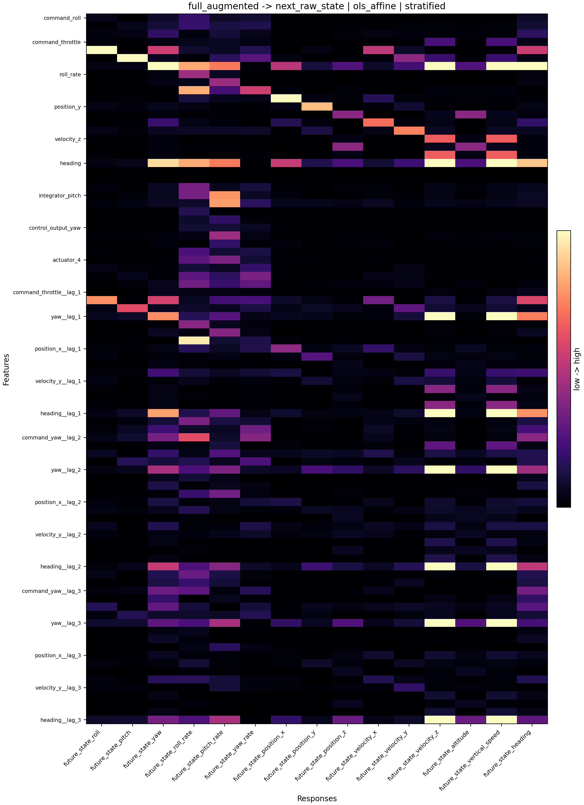
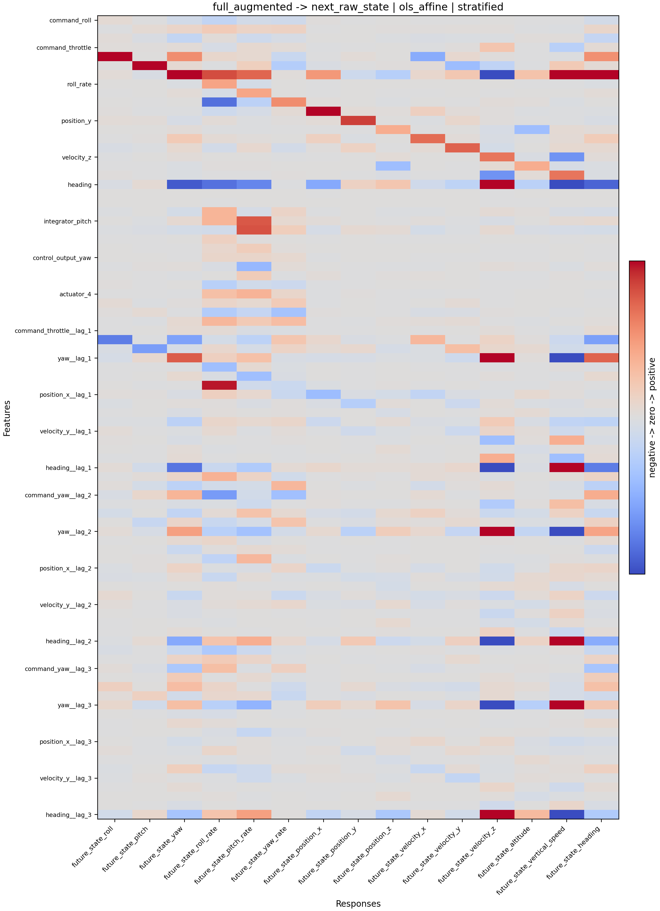
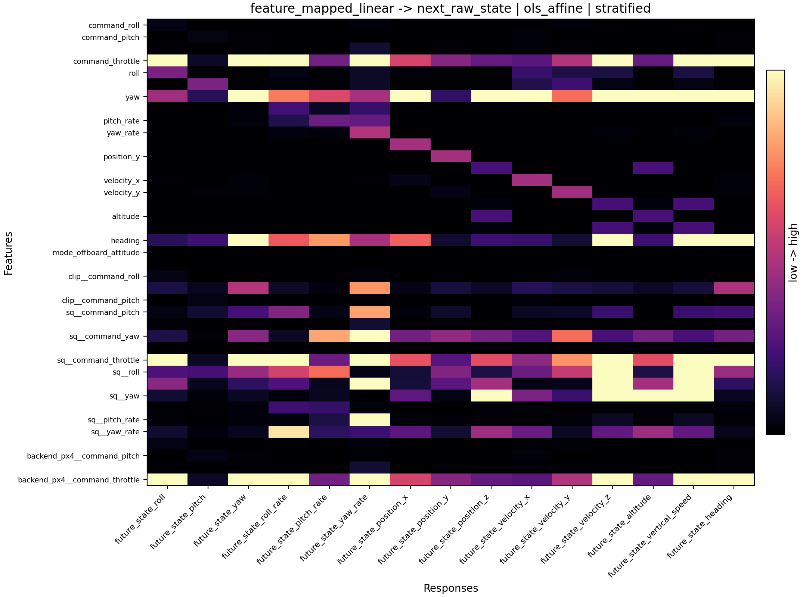
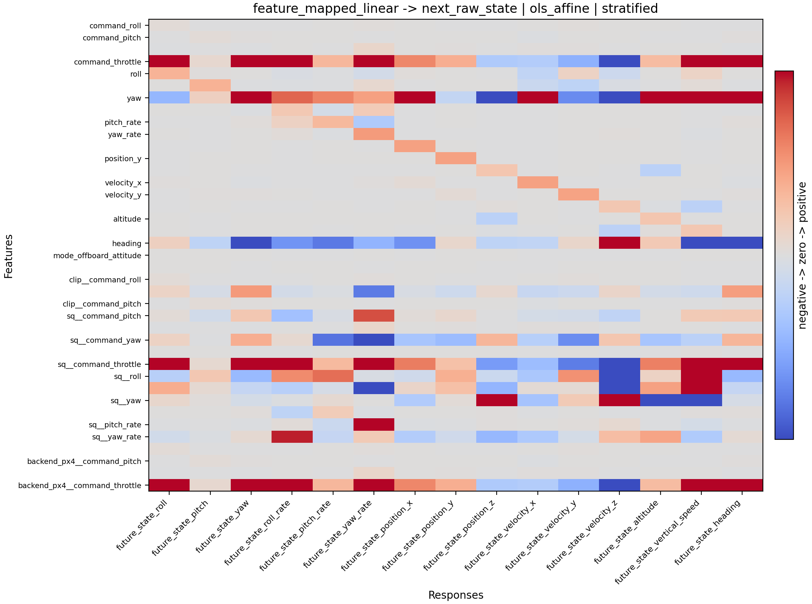
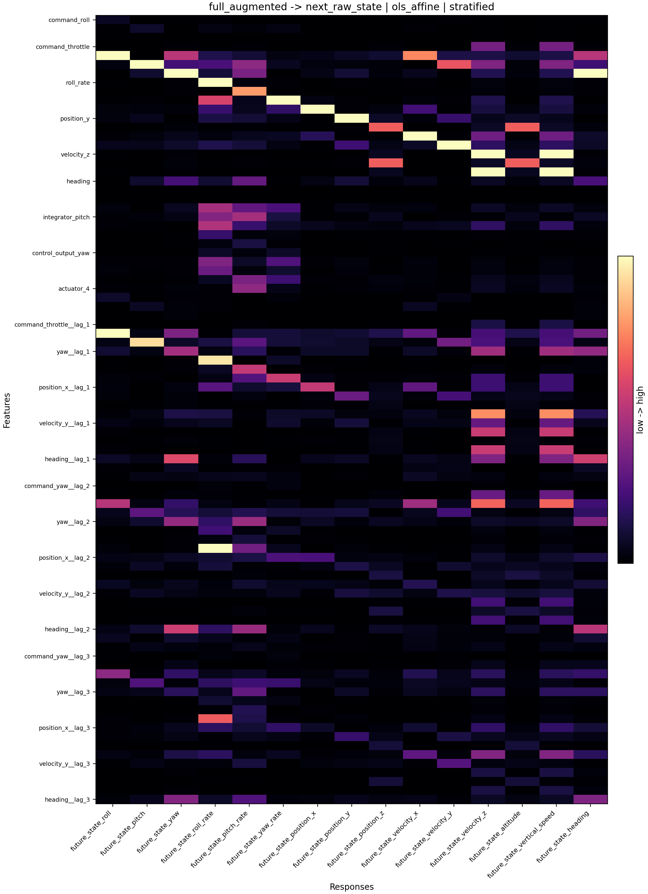
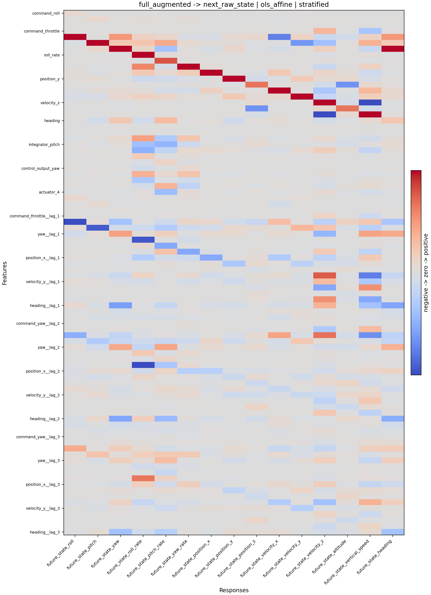
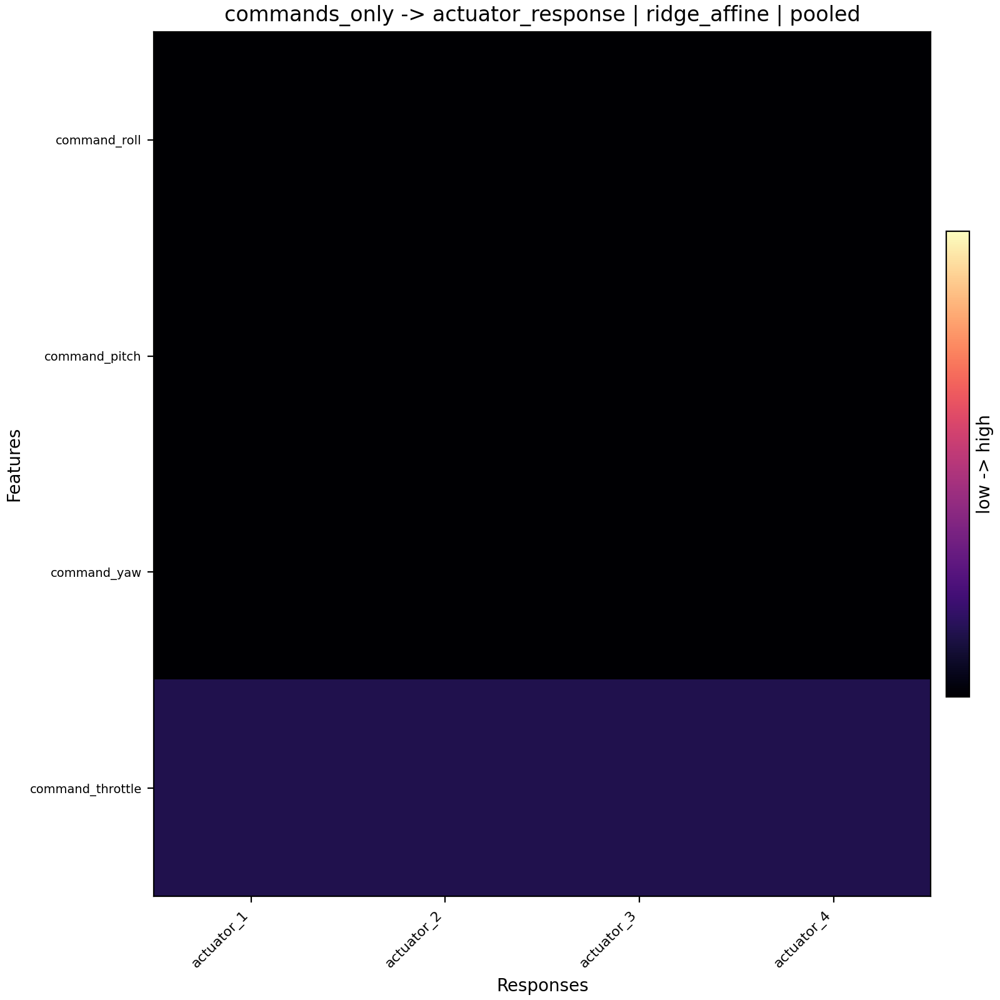
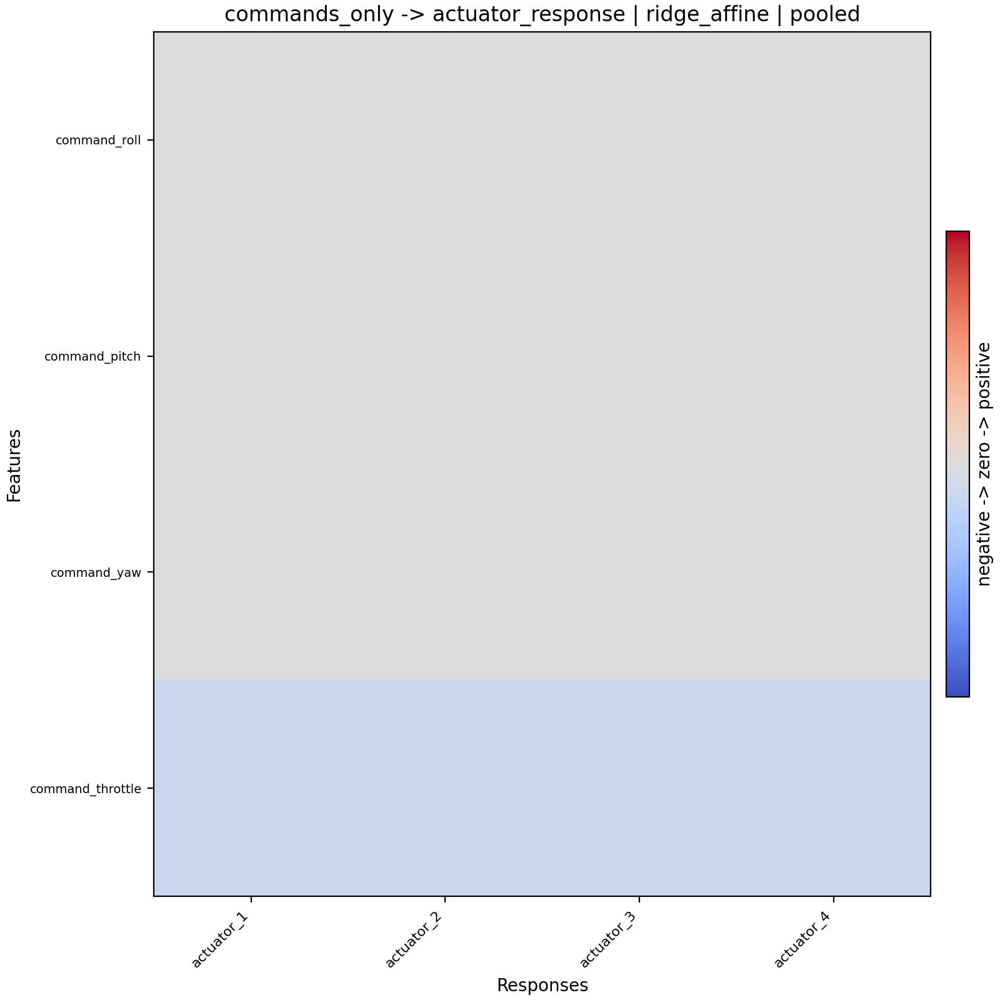
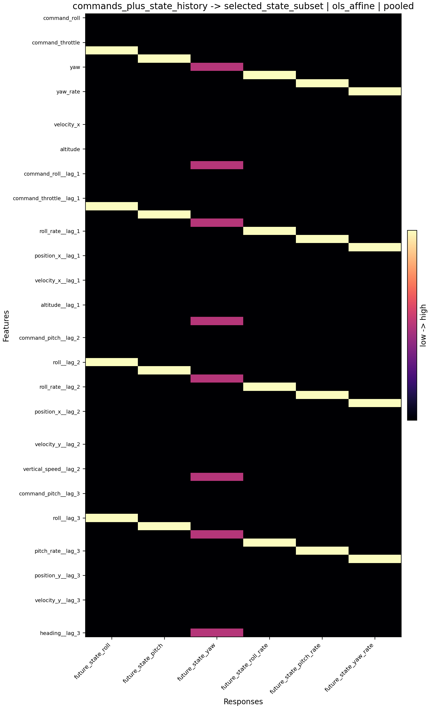
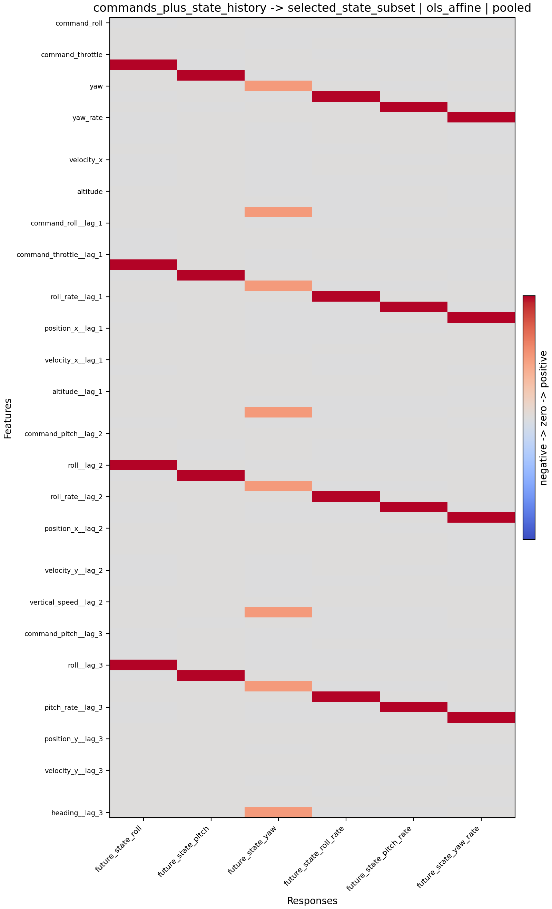

# 统一 Schema 口径下全局线性 `f` 的技术附录

## 1. 正式 artifact 清单

- PX4 baseline study: `../artifacts/studies/20260410_224818_px4_real_generalization_ablation`
- ArduPilot baseline study: `../artifacts/studies/20260411_095055_ardupilot_real_generalization_ablation`
- PX4 diagnostic study: `../artifacts/studies/20260411_021910_px4_generalization_diagnostic_matrix`
- ArduPilot diagnostic study: `../artifacts/studies/20260411_105433_ardupilot_generalization_diagnostic_matrix`
- final compare: `../artifacts/studies/20260411_124108_px4_vs_ardupilot_compare`

## 2. 支持性 artifact

- GUIDED_NOGPS smoke: `../artifacts/ardupilot_matrix/20260409_121755_ardupilot`
- STABILIZE partial baseline: `../artifacts/studies/20260409_122239_ardupilot_stabilize_partial_baseline`
- STABILIZE throttle diagnostic: `../artifacts/studies/20260409_122955_ardupilot_diagnostic_stabilize_throttle`
- cross-backend contract audit: `../artifacts/studies/20260409_123128_cross_backend_contract_audit`

## 3. baseline 关键数字

- PX4 accepted runs: `30`
- PX4 supported anchor: `full_augmented | next_raw_state | ols_affine | stratified`
- PX4 best combo: `full_augmented | next_raw_state | ols_affine | stratified`
- PX4 matrix gallery supported_count: `120`
- ArduPilot accepted runs: `30`
- ArduPilot supported anchor: `commands_only | actuator_response | ridge_affine | pooled`
- ArduPilot best combo: `commands_plus_state_history | selected_state_subset | ols_affine | pooled`
- ArduPilot baseline stability: `changed`
- ArduPilot matrix gallery supported_count: `12`

## 4. scenario_generalization 核心数字

- PX4 baseline: generalized_supported=`80`, supported_but_local=`40`, not_generalized=`96`
- PX4 diagnostic: generalized_supported=`111`, supported_but_local=`15`, not_generalized=`90`
- ArduPilot baseline: generalized_supported=`12`, supported_but_local=`0`, not_generalized=`204`
- ArduPilot diagnostic: generalized_supported=`12`, supported_but_local=`0`, not_generalized=`204`
- generalization_difference_driver: `both_support_cross_scenario_linearity_but_px4_is_broader`

## 5. state-evolution audit 摘要

- audit_status: `audit_available`
- comparison_status: `comparison_available`
- current_supported_state_evolution_count: `0`
- conclusion: `厚化 baseline 没有改变 ArduPilot 当前明确 supported 的主集合，state-evolution 路径的主阻塞仍然是 mixed/condition_number，而不是单纯 R2 不够。`
- report: `../artifacts/studies/20260411_095055_ardupilot_real_generalization_ablation/reports/state_evolution_audit.md`

## 6. diagnostic gate 摘要

- PX4 throttle_boundary: `mixed`; nonzero_gate_blocked=`true`
- ArduPilot throttle_boundary: `none`; nonzero_gate_blocked=`false`

## 7. 代表性组合与矩阵图

这一节只嵌入最值得直接看的几张图。完整清单见 `docs/figures/heatmaps/README.md`。

### PX4 Baseline 主图

组合：`full_augmented | next_raw_state | ols_affine | stratified`

矩阵：`../artifacts/studies/20260410_224818_px4_real_generalization_ablation/fits/full_augmented__next_raw_state__stratified/ols_affine/matrix_f.csv`

绝对值热力图：

带符号热力图：

解释：

- 这组图代表当前 PX4 最可信的 state-evolution 主结论，因为它同时满足高 `R2`、可接受条件数和跨 scenario 的 generalized-supported。
- 绝对值图里如果能看到少数稳定的强连接，而不是满图平均发亮，通常说明模型不是在“到处都抄一点”。
- 带符号图更重要，它能看出某些输入对未来状态是正向还是反向影响，这比只看分数更接近物理解释。

### PX4 Baseline 对照图

组合：`feature_mapped_linear | next_raw_state | ols_affine | stratified`

这组图用来对照 “generalized-supported” 和 “supported-but-local” 的差别。

绝对值热力图：

带符号热力图：

解释：

- 这组图故意放在主图后面，是为了说明“支持线性”不等于“已经跨 scenario 稳定泛化”。
- 它在整体上可以得到 supported，但只要 scenario consistency 不够，正式判读就只能算 `supported-but-local`。
- 读图时要特别看主结构是否和 PX4 baseline 主图相近；如果结构相近但强度和符号在不同 scenario 下更易漂移，它就更像局部 operating-point 映射。

### PX4 Diagnostic 主图

组合：`full_augmented | next_raw_state | ols_affine | stratified`

矩阵：`../artifacts/studies/20260411_021910_px4_generalization_diagnostic_matrix/fits/full_augmented__next_raw_state__stratified/ols_affine/matrix_f.csv`

绝对值热力图：

带符号热力图：

解释：

- 这组图比 baseline 更苛刻，因为 diagnostic 里动作是拆开、放大、并加入随机/交替模式后再做分析。
- 它还能保持 generalized-supported，说明 PX4 的线性结构不是只靠 baseline 那种较平滑的 composite 激励才成立。
- 如果 baseline 主图和 diagnostic 主图的主连接大体一致，这会增强“当前看到的是常见结构，而不是某种偶然拟合”的可信度。

### ArduPilot Baseline 主图

组合：`commands_only | actuator_response | ridge_affine | pooled`

矩阵：`../artifacts/studies/20260411_095055_ardupilot_real_generalization_ablation/fits/commands_only__actuator_response__pooled/ridge_affine/matrix_f.csv`

绝对值热力图：

带符号热力图：

解释：

- 这组图代表当前 ArduPilot 最稳的正面证据，重点不是“状态演化已经完全站稳”，而是“命令到 actuator response 的线性映射已经跨 scenario 重复出现”。
- 读这张图时，最该关注的是 throttle/姿态命令到 actuator 列的主连接是否干净、重复、而且没有大量无意义的小连接漏出来。
- 它之所以重要，是因为它说明 ArduPilot 不是“完全没有线性”，而是当前最稳的线性证据还集中在更直接的响应路径上。

### ArduPilot 高分但不稳对照图

组合：`commands_plus_state_history | selected_state_subset | ols_affine | pooled`

这组图不是当前正式 supported 主结论，它保留下来是为了说明 “R2 很高” 和 “结构真正站稳” 不是一回事。

矩阵：`../artifacts/studies/20260411_095055_ardupilot_real_generalization_ablation/fits/commands_plus_state_history__selected_state_subset__pooled/ols_affine/matrix_f.csv`

绝对值热力图：

带符号热力图：

解释：

- 这组图的意义在于提醒读者：`R2` 很高，仍然不等于“这个矩阵已经可以当作正式主结论”。
- 如果图里出现很多分散、彼此抵消、或者看起来像“当前状态直接拷贝到未来状态”的强连接，它通常意味着模型吃到了 persistence 和共线性，而不是学到了稳健的 command-to-state 结构。
- 这也是为什么 ArduPilot 当前 state-evolution 路径要结合条件数和稳定性一起读，而不能只拿一个高分就宣布它已经站稳。

## 8. compare 摘要

- compare_dir: `../artifacts/studies/20260411_124108_px4_vs_ardupilot_compare`
- difference_driver: `baseline_stability_unresolved`
- both_baselines_stable: `false`
- throttle_boundary_consistent: `false`

## 9. 历史阶段 artifact

- 20260409 broad baseline / diagnostic 仍保留为历史路径，不再作为当前正式 compare 主输入。

## 10. 当前稳妥的技术结论

- 两个 backend 的正式 baseline 和 diagnostic 都已经形成完整 artifact。
- 两个 backend 都已经给出跨 scenario generalized-supported 证据。
- PX4 对状态演化类线性映射的 generalized-supported 支持继续更强、更宽。
- ArduPilot 的高分 state-evolution 结果仍需要结合条件数和稳定性一起解释。
- 因此现在可以把“线性关系存在且具有一定跨场景泛化性”作为正面结论汇报，但不应把“backend 差异”写成最终主结论。
